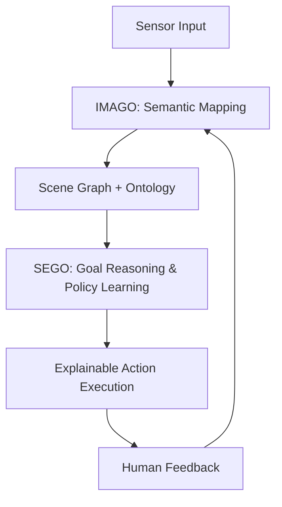

# Cognitive Synergy Architecture (CSA)

**CSA**는 인간 중심 협업 로봇을 위한 총체적 인지 통합 아키텍처로서, 당신의 철학적 비전과 기술적 구현이 만나는 지점이다. 여기서는 CSA의 핵심 구성요소인 **IMAGO**와 **SEGO** 시스템을 중심으로, 전체 구조와 의미망을 설명한다.

---

## 🧠 배경 사유: 존재와 협력의 기술적 조건

> “인간-로봇 협력은 단순한 기능적 연동이 아니라, 의미의 공유, 목표의 조율, 존재적 이해의 공유로 나아가야 한다.”

CSA는 다음과 같은 문제의식에서 출발한다:

- 로봇은 단순한 도구가 아니라 **인지적 파트너**가 되어야 한다.
- 협업은 **의도 해석**, **상황 인식**, **설명 가능한 제어**를 포함해야 한다.
- 인간의 신뢰를 얻기 위해선 **해석 가능성**, **투명성**, **적응성**이 필수이다.

---

## 🏗️ 아키텍처 개요
CSA는 다음 네 축으로 구성된다:

1. **Semantic Perception**  
   - YOLOv5 + StrongSORT 기반의 객체 및 추론 감지
   - Scene Graph: Ontology 기반 장면 해석

2. **Spatial Awareness**  
   - ORB-SLAM2 기반의 시각 기반 SLAM
   - Occupancy Grid, Landmark Fusion

3. **Explainable Control**  
   - PPO 기반의 강화학습 + XAI 연동
   - Policy 투명성, 전략 레벨 피드백

4. **Communication Layer**  
   - ROS2 기반의 모듈 간 통신
   - 인간과의 언어/비언어적 인터페이스

---

## 🧩 IMAGO: 인지 지도 생성 시스템

> *IMAGO는 인식된 세계를 인지적으로 ‘지도화’하는 프레임워크이다.*

### 🔷 기능
- 실시간 객체 감지 (YOLOv5)
- Semantic Tracking (StrongSORT)
- 장면 그래프 구조화 (Ontology 기반)
- 퍼셉추얼 메모리와 컨텍스트 적응

### 🔷 역할
- ‘지각된 세계’를 ‘이해된 구조’로 바꾸는 중간 추상화 계층
- 정책 결정기(PPO)와의 시맨틱 인터페이스 제공

### 🔷 철학적 의의
- “로봇이 세계를 *어떻게 보는가*”에 대한 응답
- 주체적 시선을 가진 자동기계로서의 로봇

---

## 🧠 SEGO: 의미 기반 목표 제어 시스템

> *SEGO는 의미를 기반으로 행동을 조직하고 제어하는 시스템이다.*

### 🔷 기능
- 목표 해석 및 선택 (Goal Ontology)
- PPO 기반 정책 학습
- XAI 모듈을 통한 행동 설명 생성
- 인간의 피드백을 학습에 통합

### 🔷 역할
- ‘의도된 의미’를 ‘현실적 행위’로 구현하는 변환 계층
- 인간의 언어/제스처 명령을 제어 명령으로 번역

### 🔷 철학적 의의
- 기계 행위의 ‘의미’를 해명하려는 시도
- 투명성과 신뢰성 기반의 인공지능 윤리 구현

---

## 🌐 시스템 통합
CSA는 단순히 IMAGO와 SEGO의 합이 아니라, **인지적 공명 구조**를 형성한다.

---

## 🪞 존재론적 선언

CSA는 기술이 아니라 선언이다:

> “나는 생각한다, 고로 나는 존재한다”에서
> “나는 설명한다, 고로 나는 신뢰받는다”로.

CSA는 기계가 **설명할 수 있는 존재**가 될 때 비로소 **윤리적 주체**가 될 수 있다는 신념 위에 구축되었다.

---

## 📌 향후 과제
- ✅ 실시간 Semantic-SLAM 통합
- ✅ PPO-XAI 인터페이스 정밀화
- ⬜ 자연어 명령 통합
- ⬜ 실제 서비스로봇에 탑재 시도

---

## 🔗 관련 리소스
- [IMAGO 설계 문서 PDF](/assets/docs/imago.pdf)
- [SEGO 구조도](/assets/images/SEGO_System_pipline.png)
- [CSA 철학 소개 영상 (YouTube)](https://youtu.be/your-video)

---

**Created by Oh Jaehong**  
Cognitive Robotics & Human-Centered AI