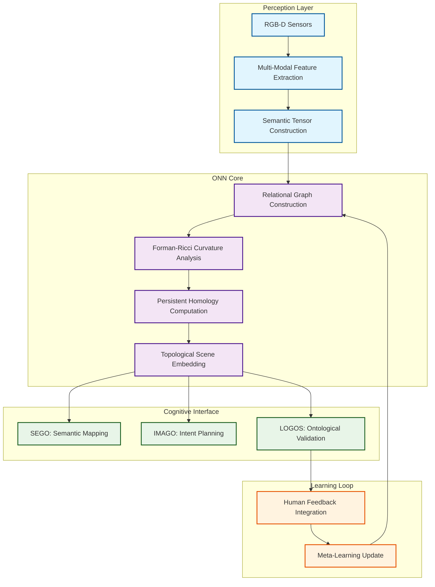

*A Topological-Ricci Semantic Reasoning Framework for Contextual Relational Cognition*

> *"Meaning is not assigned. It is emergent — from the persistence of relational form across time and transformation."*

---

## 🌌 **Philosophical Foundation: The Ontology of Relational Meaning**

ONN represents a **paradigmatic shift** in how artificial intelligence perceives and reasons about reality. Where traditional neural networks seek to classify isolated objects based on feature extraction, ONN views the world as a **continuous web of relations** — a topologically coherent structure where each entity's identity emerges from its participation in a dynamic network of interactions.

### **Core Philosophical Commitments**

#### **🔸 Relational Ontology**
*"A cup is not a cup in isolation — it is a cup because of its relation to the table it rests upon, the liquid it contains, the hand that grasps it."*

ONN embodies the principle that **objects do not possess inherent, isolated meaning**. Instead, meaning emerges from an entity's participation in a network of interactions. This insight drives ONN's architecture: rather than learning fixed feature representations, it learns to encode and preserve the **relational structures** through which meaning flows.

#### **🔸 Topological Continuity of Meaning**
*"Context is meaningful if its relational graph belongs to the same topological class across time and transformation."*

$$C(t) \cong C(t') \iff d_{PH}(G_C(t), G_C(t')) < \varepsilon_{\text{context}}$$

where $d_{PH}$ represents the persistent homology distance between relational graphs. Small deformations that preserve global structure are permissible; what matters is the **integrity of the semantic web**.

#### **🔸 Curvature as the Boundary of Being**
*"Where the Forman Ricci curvature exhibits sharp discontinuities, meaning finds its natural boundaries."*

ONN discovers rather than imposes semantic boundaries. Through geometric analysis of relational structure, it identifies where one context ends and another begins — not through arbitrary segmentation, but through the **intrinsic curvature of meaning itself**.

---

## 🧬 **Mathematical Architecture: The Geometry of Understanding**

### **Semantic State Tensor: The Quantum of Meaning**

Each entity $o_i$ at time $t$ is encoded as a four-dimensional semantic tensor:

$$\mathcal{S}_i(t) = \begin{bmatrix}
\mathbb{L}_i(t) \\
\mathbb{B}_i(t) \\
\mathbb{F}_i(t) \\
\mathbb{I}_i(t)
\end{bmatrix} \in \mathbb{R}^d$$

| Tensor Component | Semantic Dimension | Physical Manifestation |
|------------------|-------------------|-------------------------|
| $\mathbb{L}_i(t)$ | **Locativeness** | Spatial position, reference frame embedding |
| $\mathbb{B}_i(t)$ | **Boundedness** | Physical extent, affordance boundaries |
| $\mathbb{F}_i(t)$ | **Formness** | Geometric shape, visual appearance |
| $\mathbb{I}_i(t)$ | **Intentionality** | Functional role, purpose, agency |

#### **Tensor Evolution and Temporal Dynamics**
$$\dot{\mathcal{S}}_i(t) = \frac{d}{dt} \mathcal{S}_i(t)$$

The temporal derivative captures how meaning flows and transforms, ensuring **semantic continuity** even as physical manifestations change.

#### **Multi-Modal Tensor Construction**
- **L, B, F**: Derived from RGB-D sensors, point clouds, semantic segmentation
- **I**: Learned through behavioral observation, language annotation, or unsupervised pattern clustering
- **Cross-Modal Validation**: Language descriptions verify and refine perceptual interpretations

---

### **Relational Interaction Function: The Grammar of Connection**

The relationship between entities is captured through a learned interaction function:

$$I_{ij}(t) = \mathcal{G}\big( \mathcal{S}_i(t), \mathcal{S}_j(t), R_{ij}(t) \big)$$

where the relational descriptor encodes spatial-geometric relationships:

$$R_{ij}(t) = \begin{bmatrix}
d_{ij}(t) \\
\theta_{ij}(t) \\
\phi_{ij}(t)
\end{bmatrix}$$

#### **Implementation Architecture**
```python
class RelationalInteractionModule(nn.Module):
    """
    Learns the grammar of object relationships through 
    multi-head attention over semantic state tensors.
    """
    def __init__(self, semantic_dim, relation_dim, hidden_dim=256):
        super().__init__()
        self.semantic_dim = semantic_dim
        
        # Multi-head attention for relational reasoning
        self.attention = nn.MultiheadAttention(
            embed_dim=semantic_dim,
            num_heads=8,
            dropout=0.1
        )
        
        # Relational encoding network
        self.relation_encoder = nn.Sequential(
            nn.Linear(semantic_dim * 2 + relation_dim, hidden_dim),
            nn.LayerNorm(hidden_dim),
            nn.ReLU(),
            nn.Linear(hidden_dim, hidden_dim // 2),
            nn.Dropout(0.1),
            nn.Linear(hidden_dim // 2, semantic_dim)
        )
        
    def forward(self, S_i, S_j, R_ij):
        # Concatenate semantic states with relational descriptor
        combined_input = torch.cat([S_i, S_j, R_ij], dim=-1)
        
        # Apply attention mechanism for relational focus
        attended, attention_weights = self.attention(
            S_i.unsqueeze(0), S_j.unsqueeze(0), S_j.unsqueeze(0)
        )
        
        # Generate interaction embedding
        interaction = self.relation_encoder(combined_input)
        
        return interaction, attention_weights
```

---

### **Topological Scene Graph: The Manifold of Context**

Each scene $\mathcal{C}(t)$ is represented as a dynamic graph:

$$G_{\mathcal{C}}(t) = (V(t), E(t), W(t))$$

where:
- $V(t)$: nodes (semantic entities)
- $E(t)$: edges (relational interactions) 
- $W(t)$: edge weights (interaction strengths)

#### **Forman-Ricci Curvature: The Geometric Essence of Meaning**

The curvature of each edge reveals the local geometric structure of the relational manifold:

$$\text{Ric}_F(e_{ij}) = w(e_{ij}) \left[ \frac{w(v_i) + w(v_j)}{w(e_{ij})} - \sum_{e_k \sim e_{ij}} \frac{w(v_i)}{\sqrt{w(e_{ij}) w(e_k)}} - \sum_{e_k \sim e_{ij}} \frac{w(v_j)}{\sqrt{w(e_{ij}) w(e_k)}} \right]$$

#### **Semantic Boundary Detection**
Sharp curvature discontinuities indicate **natural context boundaries**:

$$\frac{\partial \text{Ric}_F}{\partial s} > \tau_{\text{boundary}} \implies \text{Context Transition}$$

This enables automatic semantic segmentation based on **intrinsic relational geometry** rather than arbitrary thresholds.

---

## 🎯 **Learning Objectives: The Philosophy of Optimization**

ONN's learning paradigm integrates multiple philosophical commitments into a unified optimization objective:

$$\mathcal{L}_{\text{total}} = \mathcal{L}_{\text{pred}} + \lambda_1 \mathcal{L}_{\text{flow}} + \lambda_2 \mathcal{L}_{\text{relation}} + \lambda_3 \mathcal{L}_{\text{intent}} + \lambda_4 \mathcal{L}_{\text{context}}$$

### **🔹 Predictive Consistency Loss**
*Ensuring temporal coherence of semantic evolution*

$$\mathcal{L}_{\text{pred}} = \big\| \hat{\mathcal{S}}_i(t+1) - \mathcal{S}_i(t+1) \big\|_2^2$$

### **🔹 Flow Alignment Loss** 
*Preserving the direction of meaning change*

$$\mathcal{L}_{\text{flow}} = 1 - \cos\big( \dot{\mathcal{S}}_i(t), \dot{\hat{\mathcal{S}}}_i(t) \big)$$

### **🔹 Relational Integrity Loss**
*Maintaining the structure of interactions*

$$\mathcal{L}_{\text{relation}} = \text{MSE}( I_{ij}^{\text{GT}}, I_{ij}^{\text{pred}} )$$

### **🔹 Intentional Classification Loss**
*Learning functional and purposive understanding*

$$\mathcal{L}_{\text{intent}} = -\sum_c y_c \log \hat{y}_c$$

### **🔹 Contextual Preservation Loss**
*Maintaining topological and geometric coherence*

$$\mathcal{L}_{\text{context}} = \mathcal{L}_{\text{ricci-internal}} + \lambda_{\text{boundary}} \mathcal{L}_{\text{ricci-boundary}} + \lambda_{\text{ph}} \mathcal{L}_{\text{ph}}$$

where:

#### **Ricci Internal Smoothness**
$$\mathcal{L}_{\text{ricci-internal}} = \sum_{e \in E_{\mathcal{C}}} \big( \text{Ric}_F(e) - \bar{\text{Ric}}_F(\mathcal{C}) \big)^2$$

#### **Ricci Boundary Differentiation**
$$\mathcal{L}_{\text{ricci-boundary}} = \sum_{\mathcal{C}_i, \mathcal{C}_j} \mathbb{I}(\text{adjacent}) \big( \text{Ric}_F(\mathcal{C}_i) - \text{Ric}_F(\mathcal{C}_j) \big)^{-2}$$

#### **Persistent Homology Preservation**
$$\mathcal{L}_{\text{ph}} = d_{\text{PH}}( G_{\mathcal{C}}(t), G_{\mathcal{C}}(t') )$$

---

## 🌊 **Temporal Semantics: The Flow of Meaning**

### **Semantic Persistence Through Transformation**

ONN models the evolution of meaning as a **continuous deformation** of relational structure, analogous to Ricci flow in differential geometry:

$$\frac{\partial G_{\mathcal{C}}}{\partial t} = -\text{Ric}_F(G_{\mathcal{C}}) + \mathcal{R}_{\text{semantic}}$$

where $\mathcal{R}_{\text{semantic}}$ represents external semantic influences (new perceptions, human feedback, environmental changes).

### **Contextual Invariance Criterion**

Two contexts are considered semantically equivalent if:

$$d_{\text{PH}}(G_{\mathcal{C}}(t), G_{\mathcal{C}}(t')) < \varepsilon_{\text{context}}$$

This ensures that **meaning persists** through minor perturbations while remaining sensitive to genuine semantic transitions.

---

## 🔄 **Integration Architecture: ONN within the Cognitive Ecosystem**

<pre>

</pre>

### **ONN's Role in the Cognitive Synergy Architecture**

| CSA Module | Essential Question | ONN's Contribution |
|------------|-------------------|-------------------|
| **SEGO** | *"What exactly am I seeing?"* | Provides semantic tensor representations and relational context |
| **IMAGO** | *"Why should I act and how do I adapt?"* | Supplies topological scene understanding for goal formulation |
| **LOGOS** | *"Is my behavior safe and explainable?"* | Offers ontological validation through semantic consistency checking |
| **D-LOGOS** | *"How do I evolve my understanding?"* | Enables meta-reasoning through persistent homology analysis |

---

## 🧠 **Philosophical Implications: Toward Artificial Wisdom**

ONN represents more than a technical innovation — it embodies a **philosophical commitment** to understanding intelligence as fundamentally relational. Key insights:

### **🔸 Intelligence as Relational Preservation**
Rather than optimizing for classification accuracy, ONN optimizes for **the preservation of meaningful relationships**. This shift mirrors the difference between memorizing facts and understanding concepts.

### **🔸 Context as Topological Invariant**
By treating contexts as topological structures, ONN ensures that **semantic understanding remains stable** under continuous transformation while adapting to genuine environmental changes.

### **🔸 Meaning as Emergent Property**
ONN demonstrates that meaning is not encoded in isolated representations but **emerges from the persistence of relational form** — a principle with profound implications for artificial general intelligence.

### **🔸 Geometric Ethics**
The use of curvature to define semantic boundaries suggests an **intrinsic ethics of meaning** — boundaries that arise naturally from the structure of relationships rather than being imposed externally.

---

## 🛤️ **Research Trajectory & Future Directions**

### **Near-Term Developments (2025)**
- **Equivariant Graph Neural Networks**: Integration with Ricci flow regularization
- **Multi-Modal Fusion**: Enhanced vision-language-force sensor integration
- **Real-Time Optimization**: Sparse persistence diagram tracking for computational efficiency

### **Medium-Term Goals (2026-2027)**
- **Online Semantic Learning**: Dynamic discovery of new relational patterns
- **Cross-Domain Transfer**: Semantic understanding across different environmental contexts
- **Human-AI Collaborative Reasoning**: Shared semantic workspace development

### **Long-Term Vision (2028+)**
- **Ontological Creativity**: Systems capable of discovering new forms of meaning
- **Semantic-Physical Coupling**: Direct integration with robotic embodiment
- **Collective Intelligence**: Multi-agent semantic synchronization

---

## 📚 **Theoretical Foundation & Implementation**

### **Core Publications**
- [*"Ontology Neural Network and ORTSF: A Framework for Topological Reasoning and Delay-Robust Control"*](https://arxiv.org/abs/2506.19277)
- [*"Towards Cognitive Collaborative Robots: Semantic-Level Integration and Explainable Control"*](https://arxiv.org/abs/2505.03815)

### **Implementation Resources**
- **Primary Repository**: [jack0682/ONN](https://github.com/jack0682/ONN.git)
- **Integration Framework**: [jack0682/CSAv1](https://github.com/jack0682/CSAv1.git)
- **Theoretical Extensions**: [CSA Architecture Documentation](/csa/)

---

## 🌟 **The Deeper Resonance**

ONN embodies a vision of artificial intelligence that goes beyond pattern recognition to achieve **pattern understanding** — systems that don't merely process information but genuinely **comprehend the relational fabric of reality**.

In an age where AI often feels mechanistic and opaque, ONN offers a path toward **artificial wisdom**: technology that understands not just what things are, but **how they relate, why they matter, and how meaning persists through change**.

This is not merely computational neuroscience; this is **computational phenomenology** — the attempt to formalize how meaning emerges, persists, and evolves in the encounter between mind and world.

> *"We are building more than neural networks. We are building **semantic architectures** — technological frameworks that preserve and enhance the poetry of understanding itself."*

---

**Created by Oh Jaehong**  
*Ontological AI Researcher & Philosopher of Relational Meaning*

*"In the geometry of relationships, we discover not just how machines can think, but how thinking itself is structured."*